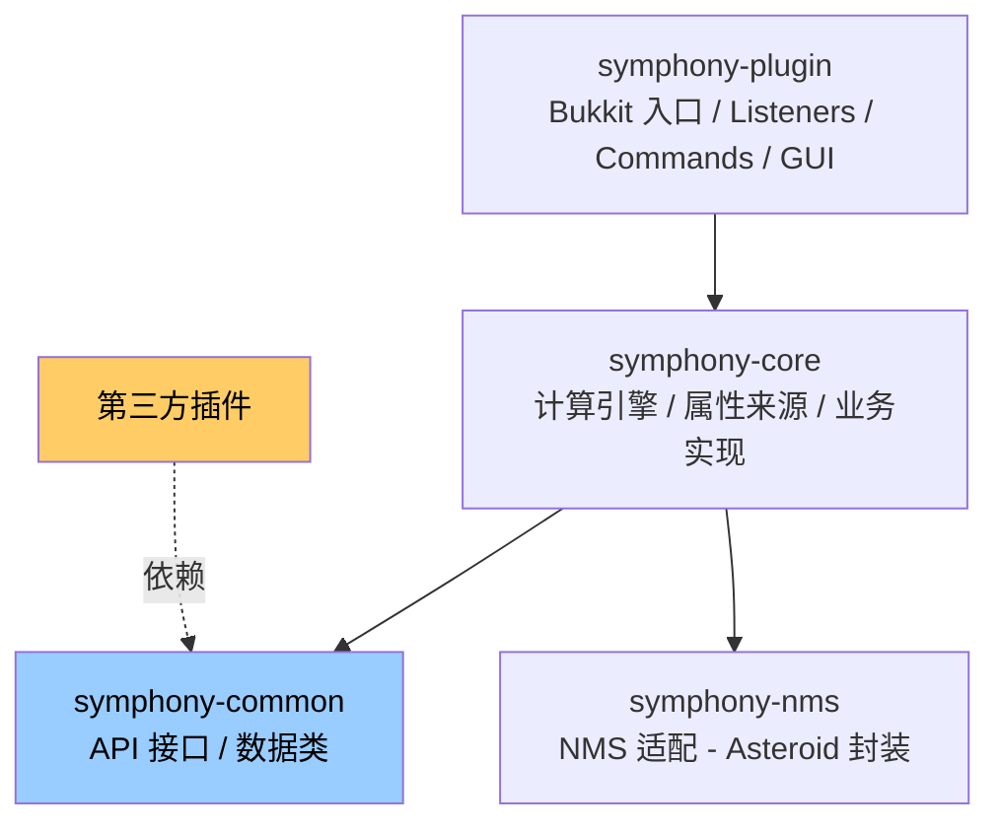
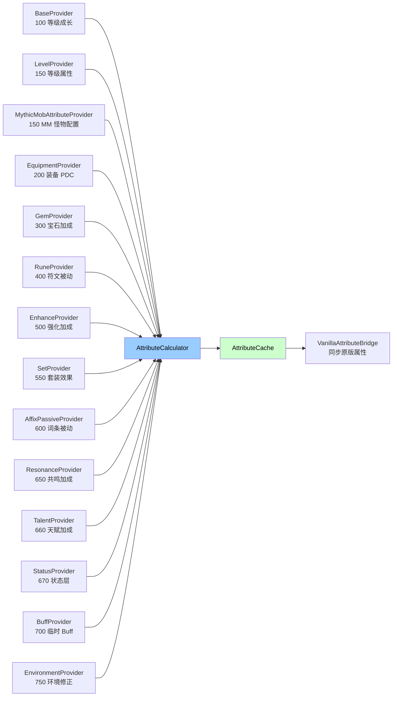

# 系统架构设计

Symphony 是面向 Minecraft RPG 服务器的属性引擎。属性系统 + 属性来源链式计算是核心；词条、触发器、技能、成长等子系统建立在属性引擎之上，全部 API 化允许扩展。

## 模块依赖图



第三方插件**只依赖 `symphony-common`**，零硬依赖核心实现。

## 属性来源计算链

完整 14 个属性来源链（按优先级排序）：

```
Base(100) → Level(150) → MythicMob(150) → Equipment(200) → Gem(300) → Rune(400) → Enhance(500) → Set(550) → AffixPassive(600) → Resonance(650) → Talent(660) → Status(670) → Buff(700) → Environment(750)
```



## 2. 模块划分

```
symphony/
├── symphony-common/          # 公共 API 模块
├── symphony-core/            # 核心实现模块
├── symphony-nms/             # NMS 版本适配模块
└── symphony-plugin/          # Blink 插件入口模块
```

### 2.1 symphony-common（公共 API）

纯接口和数据结构定义，不包含任何实现逻辑。其他插件只需依赖此模块即可对接 Symphony。

```
api/
├── attribute/
│   ├── IAttributeProvider      # 属性来源接口
│   ├── IAttributeManager       # 属性管理器接口
│   ├── AttributeModifier       # 属性修改器数据类
│   └── Operation               # 操作类型枚举（FLAT/PERCENT）
├── affix/
│   ├── AffixInstance           # 词条实例数据类
│   ├── IAffixManager           # 词条管理器接口
│   └── AffixRarity             # 词条稀有度枚举
├── trigger/
│   ├── ITriggerManager         # 触发器管理器接口
│   ├── ICustomCondition        # 自定义条件接口
│   └── TriggerType             # 触发器类型（可扩展的注册表模式）
├── skill/
│   ├── ISkillProvider          # 技能提供者接口
│   ├── ISkillProviderManager   # 提供者管理器接口
│   └── SkillContext            # 技能执行上下文
├── growth/
│   ├── IGrowthManager          # 成长系统统一管理器接口
│   ├── GemSlot                 # 宝石槽数据类
│   └── EnhanceResult           # 强化结果枚举
├── entity/
│   └── IEntityMetadata         # 实体元数据接口
├── event/
│   ├── AttributeUpdateEvent    # 属性变更事件
    ├── AffixTriggerEvent       # 词条触发事件
    ├── SymphonyDamageEvent     # 伤害计算事件
    ├── EnhanceEvent            # 强化事件
    └── SkillCastEvent          # 技能释放事件
```

### 2.2 symphony-core（核心实现）

所有业务逻辑的实现模块。

```
├── attribute/
│   ├── AttributeManager              # 属性注册中心（ConcurrentHashMap 存储）
│   ├── AttributeCalculator           # 属性计算引擎
│   │   └── 多层叠加：base → equipment → gem → rune → enhance → affix → buff → script
│   ├── AttributeProviderRegistry     # 属性来源注册表（优先级排序）
│   ├── VanillaAttributeBridge        # 原版属性同步
│   │   └── 通过 NMS Adapter 操作 AttributeInstance/AttributeModifier
│   └── AttributeCache                # 属性缓存（按实体 UUID 索引）
├── affix/
│   ├── AffixManager                  # 词条注册与配置加载
│   ├── AffixFactory                  # 词条实例工厂
│   ├── AffixProcessor                # 词条效果执行器
│   ├── AffixPool                     # 词条池（加权随机）
│   └── action/                       # Action 处理器
│       ├── SkillAction               # 技能调用
│       ├── AttributeBuffAction       # 属性 Buff
│       ├── DamageAction              # 伤害
│       ├── HealAction                # 治疗
│       ├── PotionAction              # 药水效果
│       ├── ParticleAction            # 粒子
│       ├── SoundAction               # 音效
│       ├── MessageAction             # 消息
│       ├── CommandAction             # 命令
│       └── ScriptAction              # Aria 脚本
├── trigger/
│   ├── TriggerManager                # 触发器类型注册
│   ├── TriggerDispatcher             # 事件分发（监听 Bukkit 事件 → 匹配触发器 → 执行）
│   ├── TriggerConditionParser        # 条件解析器（YAML → Condition 树）
│   ├── condition/                    # 条件实现
│   │   ├── ChanceCondition
│   │   ├── CooldownCondition
│   │   ├── HealthCondition
│   │   ├── AttributeCondition
│   │   ├── ScriptCondition
│   │   ├── AndCondition              # 组合：逻辑与
│   │   ├── OrCondition               # 组合：逻辑或
│   │   └── NotCondition              # 组合：逻辑非
│   └── builtin/                      # 内置触发器的 Bukkit 事件监听
│       ├── CombatTriggerListener     # 攻击/防御/击杀相关
│       ├── MovementTriggerListener   # 移动/跳跃/潜行相关
│       ├── EquipmentTriggerListener  # 装备穿戴/切换相关
│       └── PeriodicTriggerTask       # 定时触发器（BukkitRunnable）
├── skill/
│   ├── SkillProviderManager          # 提供者注册中心
│   ├── SkillDispatcher               # 技能调度（provider → skill → level → context）
│   └── builtin/
│       ├── SymphonySkillProvider     # 内置技能（YAML 配置的 Action 序列）
│       ├── AriaSkillProvider         # Aria 脚本技能
│       └── MythicMobsBridge          # MythicMobs 桥接（软依赖）
├── growth/
│   ├── level/
│   │   ├── LevelManager              # 等级管理
│   │   └── ExpCalculator             # 经验计算（Aria 公式）
│   ├── gem/
│   │   ├── GemManager                # 宝石管理
│   │   └── GemSlotHandler            # 宝石槽操作
│   ├── rune/
│   │   ├── RuneManager               # 符文管理
│   │   └── RuneActivation            # 符文激活逻辑
│   ├── enhance/
│   │   ├── EnhanceManager            # 强化管理
│   │   └── EnhanceCalculator         # 强化概率计算
│   ├── set/
│   │   ├── SetManager                # 套装管理
│   │   └── SetDetector               # 套装检测（装备变更时重新检测）
│   └── GrowthAttributeProvider       # 成长系统属性来源（统一提供等级/宝石/符文/强化/套装的属性）
├── script/
│   ├── SymphonyScriptEngine          # Aria 引擎封装（初始化、命名空间注册）
│   ├── AttributeRegistry             # 属性注册表（由脚本填充，reload 时重建）
│   ├── namespace/
│   │   ├── SymphonyBridge            # 所有 symphony.* 命名空间的实现方法
│   │   └── NamespaceRegistrar        # bootstrap 脚本注入 global.symphony（13 个子命名空间）
│   ├── FormulaEngine                 # 公式引擎（AriaCompiledRoutine 缓存池）
├── storage/
│   ├── PlayerDataManager             # 玩家数据管理（缓存 + 异步持久化）
│   ├── provider/
│   │   ├── YamlStorageProvider       # YAML 文件存储
│   │   ├── SQLiteStorageProvider     # SQLite 存储
│   │   └── MySQLStorageProvider      # MySQL 存储
│   └── cache/
│       └── PlayerCache               # 内存缓存（ConcurrentHashMap<UUID, PlayerData>）
└── command/
    └── SymphonyCommands              # BlinkCommand 命令注册
```

### 2.3 symphony-nms（NMS 适配）

版本适配模块，支持 1.18.2 - 1.21.1。优先使用 Asteroid NMS 框架实现跨版本兼容，不可用时回退到 Bukkit API。

```
├── NMSAdapter                        # NMS 适配器接口
│   ├── setAttributeModifier()        # 设置原版属性修改器
│   ├── removeAttributeModifier()     # 移除原版属性修改器
│   ├── getItemNBT()                  # 获取物品 NBT（低版本兼容）
│   ├── setItemNBT()                  # 设置物品 NBT
│   └── sendActionBar()               # 发送 ActionBar 消息
├── NMSAdapterFactory                 # 初始化时自动选择适配器
├── AsteroidNMSAdapter                # Asteroid 跨版本实现（优先）
└── BukkitFallbackAdapter             # Bukkit API 回退实现
```

### 2.4 symphony-plugin（Blink 插件入口）

```
├── SymphonyPlugin                    # 插件初始化（@Awake 生命周期钩子）
│   ├── @Awake(LOAD)    → NMS 适配器初始化、存储后端初始化
│   ├── @Awake(ENABLE)  → Aria 引擎初始化 → 执行属性脚本 → 管理器初始化 → 配置加载
│   ├── @Awake(ACTIVE)  → 定时任务启动、软依赖检测
│   └── @Awake(DISABLE) → 数据保存、资源释放
├── SymphonyConfig                    # 全局配置（BlinkConfig）
├── listener/
│   ├── PlayerJoinListener            # @AutoListener 玩家加入/退出
│   ├── DamageListener                # @AutoListener 伤害事件处理
│   └── EquipmentListener             # @AutoListener 装备变更检测
└── placeholder/
    └── SymphonyPlaceholder           # PlaceholderAPI 扩展
```

## 3. 核心数据流

### 3.1 伤害计算流程

```
EntityDamageEvent (Bukkit)
        ↓
DamageListener (@AutoListener, priority=NORMAL)
        ↓
┌─ 判断是否为 EntityDamageByEntityEvent（is 检查）
├─ 获取攻击者/受击者的 AttributeHolder
├─ 读取攻击者属性：physical_damage, critical_chance, critical_damage, penetration, 元素伤害...
├─ 读取受击者属性：physical_defense, damage_reduction, dodge, block_chance, 元素抗性...
├─ 判定闪避 → 触发 ON_DODGE
├─ 判定格挡 → 触发 ON_BLOCK
├─ 判定暴击 → 触发 ON_ATTACK_CRITICAL
├─ 计算物理伤害：(atk - def * (1 - penetration)) * critMultiplier
├─ 计算元素伤害：Σ(element_damage * (1 - element_resistance))
├─ 应用伤害减免：finalDamage * (1 - damage_reduction)
├─ 发布 SymphonyDamageEvent（允许其他插件修改）
├─ 设置最终伤害到 Bukkit 事件
├─ 触发 ON_ATTACK（攻击者词条）
├─ 触发 ON_DEFEND（受击者词条）
└─ 触发 ON_DAMAGE（最终伤害确认后）
```

### 3.2 属性更新流程

```
属性变更触发点：
  - 装备穿戴/卸下
  - 词条添加/移除
  - Buff 添加/过期
  - 等级变化
  - 宝石镶嵌/拆卸
  - 符文激活/关闭
  - 强化等级变化
  - 套装件数变化
  - 脚本修改
  - /symphony reload（属性定义变更）
        ↓
AttributeCalculator.recalculate(holder)
        ↓
┌─ 收集所有 AttributeProvider（按优先级排序）
├─ 对每个已注册属性 ID（来自 AttributeRegistry，由脚本定义）：
│   ├─ 如果是派生属性（readonly=true）→ 跳过，稍后计算
│   ├─ flatSum = Σ(所有 FLAT 修改器的 value)
│   ├─ percentSum = Σ(所有 PERCENT 修改器的 value)
│   ├─ 如果属性定义了 formula（Aria 函数）：
│   │   └─ final = formula(default_value, flatSum, percentSum, holder)
│   ├─ 否则使用默认公式：
│   │   └─ final = (default_value + flatSum) × (1 + percentSum)
│   └─ clamp(final, min_value, max_value)
├─ 对每个派生属性：
│   └─ final = derive(holder)  // Aria 函数，可读取其他属性
├─ 更新 AttributeCache
├─ 同步原版属性（遍历有 vanilla_binding 的属性）
├─ 触发 on_change 回调（如果值发生变化）
└─ 发布 AttributeUpdateEvent
### 3.3 触发器分发流程

```
Bukkit 事件（如 EntityDamageByEntityEvent）
        ↓
TriggerDispatcher.onBukkitEvent()
        ↓
┌─ 映射 Bukkit 事件 → TriggerType（如 ON_ATTACK）
├─ 构建 TriggerContext（注入上下文变量）
├─ 获取实体的所有词条（装备上的 AffixInstance 列表）
├─ 对每个词条：
│   ├─ 匹配词条的 triggers 配置中 type == 当前 TriggerType 的条目
│   ├─ 评估 conditions（短路求值）
│   │   ├─ CHANCE → Random 判定
│   │   ├─ COOLDOWN → 检查冷却时间戳
│   │   ├─ AND/OR/NOT → 递归评估子条件
│   │   └─ SCRIPT → Aria.eval() 返回 boolean
│   ├─ 条件全部通过 → 发布 AffixTriggerEvent（可取消）
│   └─ 未取消 → 执行 actions 列表
│       ├─ SKILL → SkillDispatcher.dispatch(provider, skillId, level, context)
│       ├─ ATTRIBUTE_BUFF → BuffProvider.addBuff(...)
│       ├─ DAMAGE → entity.damage(...)
│       ├─ SCRIPT → Aria.eval(code, context)
│       └─ ...
└─ 完成
```

## 4. 依赖关系

```
symphony-plugin
    ├── symphony-core
    │   ├── symphony-common
    │   └── symphony-nms
    ├── blink-common (Blink 框架)
    ├── aria (Aria 脚本引擎)
    └── spigot-api (compileOnly)

外部软依赖（可选）：
    ├── MythicMobs — 技能桥接
    ├── PlaceholderAPI — 变量占位符
    └── Vault — 经济系统（未来扩展）
```

## 5. 线程模型

| 操作 | 线程 | 说明 |
|------|------|------|
| 属性计算 | 主线程 | 涉及 Bukkit API，必须同步 |
| 属性计算（async-recalc） | 异步线程池 | `performance.async-recalc: true` 时，`isAsync=true` 的属性来源采集走异步，最终 apply 仍在主线程 |
| 触发器分发 | 主线程 | 由 Bukkit 事件驱动 |
| Aria 脚本执行 | 主线程 | 短脚本同步执行，沙箱限时 |
| 数据加载/保存 | 异步线程 | BukkitScheduler.runTaskAsynchronously |
| 定时 Buff 过期检查 | 主线程 | BukkitRunnable 每 tick 检查 |
| 公式预编译 | 启动时异步 | Aria.compile() 在 ENABLE 阶段异步执行 |
