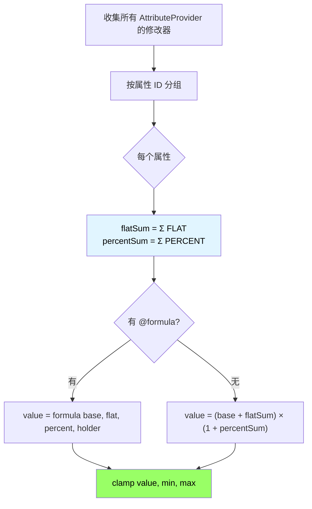
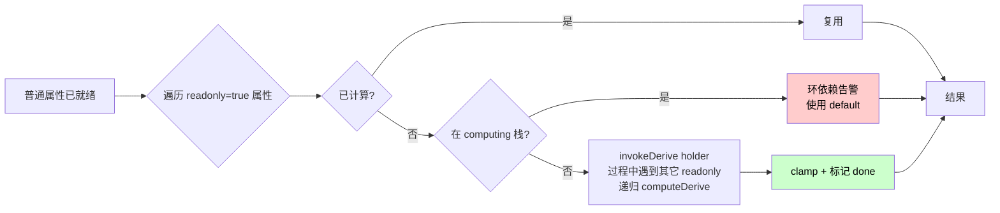

# 属性系统设计

## 1. 核心理念：脚本驱动一切

Symphony 的属性系统采用「零硬编码」设计 — 插件本身不内置任何具体属性。所有属性的定义、注册、计算逻辑、联动行为全部由 Aria 脚本驱动。

插件只提供：
- 属性引擎骨架（注册表、计算管线、缓存、原版桥接）
- Aria 运行时环境与 `symphony.*` 命名空间
- 默认属性包（`scripts/attributes/` 目录下的 .aria 脚本，可替换/删除/扩展）

这意味着：
- 服务器管理员可以删掉所有默认属性，从零开始定义自己的属性体系
- 属性的计算公式、值域约束、显示格式、原版同步规则全部在脚本中声明
- 新增属性不需要重启服务器，`/symphony reload` 即可热加载

## 2. 属性生命周期

```mermaid
flowchart TD
    Start([插件启动])
    Init[SymphonyScriptEngine 初始化 Aria 引擎<br/>共享 GlobalStorage / AnnotationRegistry]
    NS[NamespaceRegistrar 注入 global.symphony]
    Scan[递归扫描 scripts/attributes/**/*.aria<br/>逐个 evalFile]
    Parse[解析阶段：@attribute / @displayName / @derive ...<br/>进入 AnnotationRegistry]
    Process[AttributeAnnotationProcessor.process<br/>聚合 → AttributeDefinition]
    Register[AttributeRegistry.register]
    Ready([就绪：预编译公式 / 加载 mechanics])
    Reload([/symphony reload<br/>→ Registry.clear → 全部重新执行])

    Start --> Init --> NS --> Scan --> Parse --> Process --> Register --> Ready
    Ready -.-> Reload -.-> Init

    style Start fill:#9cf,color:#000
    style Ready fill:#9f6,color:#000
    style Reload fill:#fc6,color:#000
```

关键点：属性注册表（`AttributeRegistry`）在 reload 时完全重建，不存在「内置属性」和「自定义属性」的区分。

## 3. 脚本属性定义

### 3.1 注解式声明

每个属性占用一个文件，使用 Aria 注解声明元数据。Symphony 不再提供 `register({...})` map 风格 API，注解风格是唯一入口。

```aria
// scripts/attributes/combat/physical_damage.aria
@attribute('physical_damage')
@displayName('物理攻击力')
@description('物理伤害基础值')
@category('combat')
@default(1.0) @min(0.0) @max(999999.0)
@format('number')                           // number | percent | integer
@priority(10)                               // 显示排序
@vanillaBinding('generic.attack_damage')    // 绑定原版属性
@tag('offensive') @tag('physical')
class PhysicalDamage {
    // 自定义计算公式（可选）
    @formula
    calc = -> {
        val.base = args[0]
        val.flat = args[1]
        val.percent = args[2]
        return (base + flat) * (1 + percent)
    }

    // 属性变更回调（可选）
    @onChange
    sync = -> {
        // args[0] = entity, args[1] = oldValue, args[2] = newValue
    }
}
```

### 3.2 单文件单属性 + 子目录分类

替代旧的循环批量写法，每个属性使用独立文件，按 category 分子目录：

```
scripts/attributes/elements/
├── fire_damage.aria       // @attribute('fire_damage') ...
├── fire_resistance.aria
├── ice_damage.aria
├── ice_resistance.aria
└── ...
```

需要批量铺属性时使用模板/外部脚本生成文件即可，运行期不再有循环 register。

### 3.3 复杂公式属性

```aria
// scripts/attributes/combat/damage_reduction.aria
@attribute('damage_reduction')
@displayName('伤害减免')
@description('最终伤害减免比例')
@category('combat')
@default(0.0) @min(0.0) @max(0.9)
@format('percent')
@priority(30)
class DamageReduction {
    @formula
    curve = -> {
        val.base = args[0]
        val.flat = args[1]
        val.percent = args[2]
        val.raw = (base + flat) * (1 + percent)
        // 100 防御 = 50% 减伤，200 防御 = 66.7% 减伤
        return raw / (raw + 100)
    }
}
```

### 3.4 派生属性

```aria
// scripts/attributes/special/combat_power.aria
@attribute('combat_power')
@displayName('战斗力')
@description('综合战斗力评分')
@category('resource')
@default(0.0)
@format('integer')
@priority(200)
@readonly                              // 不接受外部修改器
class CombatPower {
    @derive
    calc = -> {
        val.h = args[0]                // 持有者上下文
        val.atk = symphony.attribute.getRaw(h, 'physical_damage')
        val.def = symphony.attribute.getRaw(h, 'physical_defense')
        val.hp = symphony.attribute.getRaw(h, 'max_health')
        val.crit = symphony.attribute.getRaw(h, 'critical_chance')
        val.critDmg = symphony.attribute.getRaw(h, 'critical_damage')
        val.magicAtk = symphony.attribute.getRaw(h, 'magic_damage')
        return math.floor(
            atk * 2 + magicAtk * 2 + def * 1.5 + hp * 0.5
            + crit * 200 + critDmg * 80
        )
    }
}
```

### 3.5 注解参数完整说明

| 注解                 | 参数        | 必填    | 说明                                    |
|--------------------|-----------|-------|---------------------------------------|
| `@attribute`       | String    | **是** | 唯一标识符，全局不可重复                          |
| `@displayName`     | String    | 否     | 显示名称（支持颜色代码）                          |
| `@description`     | String    | 否     | 描述文本                                  |
| `@category`        | String    | 否     | 分类标签（默认 `custom`）                     |
| `@default`         | Number    | 否     | 默认值（默认 0.0）                           |
| `@min`             | Number    | 否     | 最小值约束                                 |
| `@max`             | Number    | 否     | 最大值约束                                 |
| `@format`          | String    | 否     | 显示格式：`number` / `percent` / `integer` |
| `@priority`        | Number    | 否     | 显示排序优先级，数值越小越靠前                       |
| `@vanillaBinding`  | String    | 否     | 绑定的原版属性 ID                            |
| `@readonly`        | Boolean/无 | 否     | 是否只读（仅由 `@derive` 计算）                 |
| `@tag`             | String    | 否     | 单个标签，可重复                              |
| `@tags`            | String[]  | 否     | 批量标签                                  |
| `@formula` (类内方法)  | —         | 否     | 自定义叠加公式（接入完成中）                        |
| `@derive` (类内方法)   | —         | 否     | 派生计算函数                                |
| `@onChange` (类内方法) | —         | 否     | 属性值变更回调（接入完成中）                        |
| `@dependsOn`       | String... | 否     | 声明属性间静态依赖，用于局部脏标记传播                   |
| `@when`            | String    | 否     | 条件门控，条件不满足时属性使用默认值                    |
| `@defaultExpr`     | String    | 否     | 动态默认值表达式（Aria 脚本）                     |
| `@minExpr`         | String    | 否     | 动态最小值表达式                              |
| `@maxExpr`         | String    | 否     | 动态最大值表达式                              |

## 4. 默认属性包

Symphony 附带一套默认属性脚本作为开箱即用的 RPG 属性体系。服务器管理员可以自由修改、删除或替换。

```
plugins/Symphony/scripts/attributes/
├── combat/      # 战斗属性（20 个）
├── movement/    # 移动属性（4 个）
├── elements/    # 元素属性（6 元素 × 伤害+抗性 = 12 个）
├── resource/    # 资源属性（4 个：等级/经验加成/掉落/幸运）
├── custom/      # 自定义示例（3 个）
└── special/     # 派生属性（combat_power）
```

每个 `.aria` 文件只声明一个属性；加载器递归扫描全部子目录。默认包注册的属性清单（仅作参考，全部可改）：

### 战斗属性 (combat.aria)

| ID                 | 名称    | 默认值   | 说明                         |
|--------------------|-------|-------|----------------------------|
| `physical_damage`  | 物理攻击力 | 1.0   | 绑定 `generic.attack_damage` |
| `physical_defense` | 物理防御力 | 0.0   | 绑定 `generic.armor`         |
| `magic_damage`     | 魔法攻击力 | 0.0   | —                          |
| `magic_defense`    | 魔法防御力 | 0.0   | —                          |
| `attack_speed`     | 攻击速度  | 1.0   | 绑定 `generic.attack_speed`  |
| `critical_chance`  | 暴击率   | 0.05  | 0~1                        |
| `critical_damage`  | 暴击伤害  | 1.5   | 倍率                         |
| `max_health`       | 最大生命值 | 20.0  | 绑定 `generic.max_health`    |
| `health_regen`     | 生命恢复  | 0.0   | 每秒                         |
| `max_mana`         | 最大法力值 | 100.0 | —                          |
| `mana_regen`       | 法力恢复  | 1.0   | 每秒                         |
| `lifesteal`        | 生命偷取  | 0.0   | 0~1                        |
| `damage_reduction` | 伤害减免  | 0.0   | 非线性公式                      |
| `penetration`      | 穿透    | 0.0   | 0~1                        |
| `accuracy`         | 命中率   | 1.0   | —                          |
| `dodge`            | 闪避率   | 0.0   | 0~0.9                      |
| `block_chance`     | 格挡率   | 0.0   | 0~0.9                      |
| `block_power`      | 格挡强度  | 0.5   | 0~1                        |
| `thorns`           | 反伤    | 0.0   | 比例                         |

### 移动属性 (movement.aria)

| ID                     | 名称   | 默认值 | 绑定原版                           |
|------------------------|------|-----|--------------------------------|
| `movement_speed`       | 移动速度 | 0.2 | `generic.movement_speed`       |
| `jump_height`          | 跳跃高度 | 0.0 | —                              |
| `fly_speed`            | 飞行速度 | 0.1 | —                              |
| `knockback_resistance` | 击退抗性 | 0.0 | `generic.knockback_resistance` |

### 元素属性 (elements.aria)

6 种元素 × 2（伤害 + 抗性）= 12 个属性，通过循环批量注册：
`fire` / `ice` / `lightning` / `poison` / `holy` / `dark`

### 资源属性 (resource.aria)

| ID           | 名称   | 默认值 |
|--------------|------|-----|
| `level`      | 等级   | 1   |
| `exp_bonus`  | 经验加成 | 0.0 |
| `drop_bonus` | 掉落加成 | 0.0 |
| `luck`       | 幸运值  | 0.0 |

### 派生属性 (derived.aria)

| ID             | 名称  | 说明           |
|----------------|-----|--------------|
| `combat_power` | 战斗力 | 只读，由其他属性派生计算 |

## 5. 属性计算管线

### 5.1 两种属性类型

| 类型   | 说明         | 计算方式                                         |
|------|------------|----------------------------------------------|
| 普通属性 | 接受修改器叠加    | `formula(base, flatSum, percentSum, holder)` |
| 派生属性 | 只读，由其他属性计算 | `derive(holder)`                             |

### 5.2 普通属性计算流程



### 5.3 派生属性计算

派生属性在所有普通属性计算完毕后执行，使用「惰性递归 + 循环检测」：



### 5.4 计算公式的 Aria 上下文

公式函数执行时，通过 `args` 接收参数：

普通属性 `formula`：
- `args[0]` = 属性默认值 (default_value)
- `args[1]` = 所有 FLAT 修改器之和
- `args[2]` = 所有 PERCENT 修改器之和
- `args[3]` = holder 上下文对象（可通过 `symphony.attribute.getRaw(holder, id)` 读取其他属性）

派生属性 `derive`：
- `args[0]` = holder 上下文对象

### 5.5 属性来源（AttributeProvider）

属性值由多个来源叠加。每个来源实现 `IAttributeProvider` 接口：

```kotlin
interface IAttributeProvider {
    val id: String
    val priority: Int
    fun provide(holder: IAttributeHolder): List<AttributeModifier>
    fun shouldUpdate(holder: IAttributeHolder, event: Any?): Boolean
}

data class AttributeModifier(
    val attributeId: String,
    val operation: Operation,   // FLAT 或 PERCENT
    val value: Double,
    val source: String          // 来源标识
)
```

内置来源及优先级：

| 优先级 | 来源                           | 说明                                      |
|-----|------------------------------|-----------------------------------------|
| 100 | `BaseProvider`               | 等级成长基础值                                 |
| 150 | `LevelProvider`              | 等级属性成长（base + perLevel，支持 Aria formula） |
| 150 | `MythicMobAttributeProvider` | MythicMobs 怪物属性注入                       |
| 200 | `EquipmentProvider`          | 装备 PDC 属性                               |
| 300 | `GemProvider`                | 宝石属性                                    |
| 400 | `RuneProvider`               | 符文被动属性                                  |
| 500 | `EnhanceProvider`            | 强化倍率                                    |
| 550 | `SetProvider`                | 套装效果                                    |
| 600 | `AffixPassiveProvider`       | 词条被动属性                                  |
| 650 | `ResonanceProvider`          | 词条共鸣属性加成                                |
| 660 | `TalentProvider`             | 天赋门被动属性                                 |
| 670 | `StatusProvider`             | 状态层每层属性效果                               |
| 700 | `BuffProvider`               | 临时 Buff                                 |
| 750 | `EnvironmentProvider`        | 环境修正属性                                  |

来源优先级只影响收集顺序，不影响最终计算结果（所有 FLAT 求和、所有 PERCENT 求和后统一计算）。

## 6. 原版属性桥接

属性脚本通过 `vanilla_binding` 字段声明与原版属性的绑定关系。插件不硬编码任何绑定映射。

```aria
// 脚本中声明绑定
symphony.attribute.register({
    'id': 'max_health',
    'display_name': '最大生命值',
    'default_value': 20.0,
    'vanilla_binding': 'generic.max_health'   // ← 这里
})
```

桥接流程：

```
属性重算完毕
    ↓
收集所有 Provider 实际贡献过的属性 ID（contributed 集合）
    ↓
遍历所有已注册属性
    ↓
对每个有 vanilla_binding 的属性：
    ├── 若该属性不在 contributed 集合中：
    │   └── 移除旧 Symphony modifier，不同步（避免覆盖原版默认值）
    ├── 否则：
    │   ├── 先移除 Symphony modifier
    │   ├── 调用 NMS Adapter.getFinalValue() 获取原版最终值（含其他插件/装备的 modifier）
    │   ├── 计算差值 = symphonyFinalValue - vanillaFinalValue
    │   ├── 通过 NMS Adapter 设置 AttributeModifier
    │   │   ├── key = "symphony:<attribute_id>"
    │   │   ├── amount = 差值
    │   │   └── operation = ADD_NUMBER
    │   └── 同步到客户端
```

关键设计决策：
- 使用 `getFinalValue()` 而非 `getBaseValue()`，确保差值计算考虑了其他插件和原版装备的 modifier，避免攻击速度等属性被意外覆盖
- 无 Provider 贡献的属性不同步到原版，防止 Symphony 的默认值覆盖原版属性（如未配置攻击速度词条时，不会干扰原版攻击速度）

这意味着服务器管理员可以自由决定哪些属性同步到原版。比如自定义一个 `true_damage` 属性，不绑定任何原版属性，它就只存在于 Symphony 的计算体系中。

## 7. 脚本中的属性操作 API

属性 **定义** 通过注解完成（见 §3.1）。运行时查询和实体属性读写通过 `symphony.attribute.*`：

```aria
// 注销属性（极少使用）
symphony.attribute.unregister('my_attr')

// 查询已注册属性
val.all = symphony.attribute.list()                      // 所有属性 ID 列表
val.info = symphony.attribute.getInfo('physical_damage') // 属性定义信息
val.exists = symphony.attribute.exists('my_attr')        // 是否已注册

// 按分类查询
val.combatAttrs = symphony.attribute.listByCategory('combat')
val.taggedAttrs = symphony.attribute.listByTag('offensive')

// 运行时读取属性值
val.atk = symphony.attribute.get(entity, 'physical_damage')

// 读取原始值（不经过 derive，用于派生属性内部引用其他属性）
val.rawAtk = symphony.attribute.getRaw(holder, 'physical_damage')

// 运行时修改
symphony.attribute.modify(entity, 'physical_damage', 'FLAT', 10, 'my_source')
symphony.attribute.buff(entity, 'physical_damage', 'FLAT', 50, 10000)
symphony.attribute.remove(entity, 'my_source')

// 获取属性快照（所有属性的当前值）
val.snapshot = symphony.attribute.snapshot(entity)
```

## 8. 属性缓存策略

```
属性变更事件 → 标记 holder 为 dirty
                    ↓
下次读取时 → 检查 dirty 标记
                    ↓
            dirty=true → 重新计算所有普通属性 → 计算派生属性 → 更新缓存 → 清除 dirty
            dirty=false → 直接返回缓存值
```

缓存使用 `ConcurrentHashMap<UUID, Map<String, Double>>` 存储。实体卸载时自动清除。

## 9. 与其他子系统的关系

属性系统是 Symphony 的基础层，其他所有子系统都是属性的「来源」或「消费者」：

```
[属性来源]                              [属性消费者]
等级成长 ──┐                        ┌── 伤害计算（读取攻防暴击等）
装备属性 ──┤                        ├── 触发器条件（ATTRIBUTE_ABOVE/BELOW）
宝石属性 ──┤                        ├── 词条效果（ATTRIBUTE_BUFF）
符文属性 ──┤   → AttributeRegistry  ├── 技能脚本（symphony.attribute.get）
强化倍率 ──┤     → 计算管线         ├── 原版桥接（vanilla_binding 同步）
套装效果 ──┤     → 缓存             ├── PlaceholderAPI（%symphony_attribute_xxx%）
词条被动 ──┤                        └── 派生属性（combat_power 等）
Buff ──────┤
脚本修改 ──┘
```

所有来源只产出 `AttributeModifier`（属性ID + 操作类型 + 值 + 来源标识），不需要知道属性是怎么定义的。属性的计算逻辑完全由脚本中的 `formula` / `derive` 函数决定。
