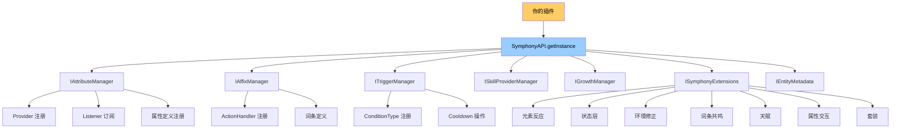
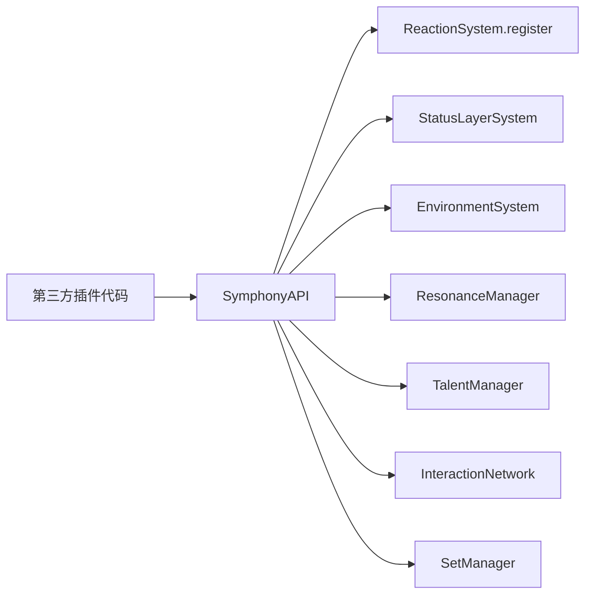
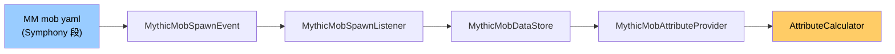
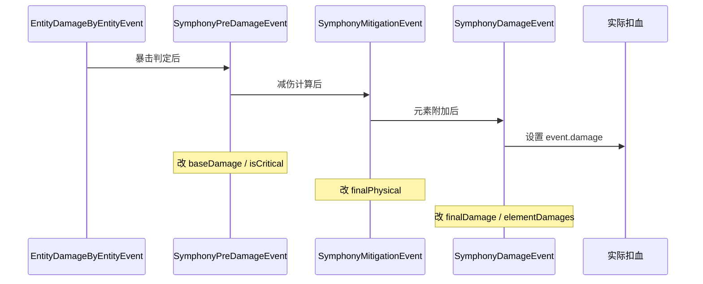
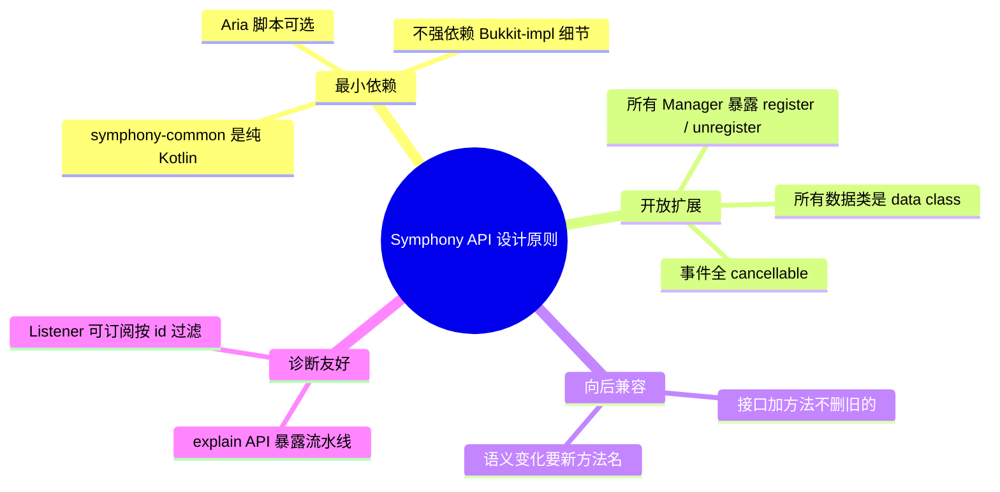

# 扩展指南

通过 `SymphonyAPI.getInstance()` 扩展 Symphony：注册属性来源、词条动作、触发器条件、元素反应、高级子系统的自定义定义等。本页按扩展点分类列出调用示例。

## 总览



## 属性引擎核心

### 注册自定义 AttributeProvider

让你的插件作为一个属性来源（货币、社交、技能加成…都可作为属性的一部分进入计算管线）。

```kotlin
class MyGuildBuffProvider : IAttributeProvider {
    override val id = "my_guild_buff"
    override val priority = 750
    override val isAsync = true   // 不碰 Bukkit 主线 API

    override fun appliesTo(entity: LivingEntity): Boolean = entity is Player

    override fun provide(entity: LivingEntity): List<AttributeModifier> {
        val player = entity as Player
        if (!isInGuild(player)) return emptyList()
        return listOf(
            AttributeModifier("physical_damage", Operation.PERCENT, 0.10, "guild:$guildId")
        )
    }
}

SymphonyAPI.getInstance().getAttributeManager().registerProvider(MyGuildBuffProvider())
```

### 属性变更编程式订阅（非 Bukkit Event）

```kotlin
SymphonyAPI.getInstance().getAttributeManager().addListener(object : AttributeListener {
    override val attributeIds = setOf("physical_damage", "max_health")
    override fun onChange(entity, id, old, new) {
        // 高频路径，纯方法调用，无反射
    }
})
```

### 属性流水线追踪

复用 Symphony 的 explain 能力做你自己的 UI / 调试工具：

```kotlin
val explain = SymphonyAPI.getInstance().explain(player, "physical_damage")
// explain.contributions: List<IAttributeContribution>
// 每个 contribution 知道哪个 Provider 贡献了多少 flat / percent
```

## 词条系统

### 注册自定义 ActionHandler

让你的插件添加新的词条 action 类型，词条 yaml 即可使用：

```kotlin
class MyTeleportAction : IActionHandler {
    override fun execute(params, context, affix) {
        val target = context.entity as? Player ?: return
        val x = (params["x"] as? Number)?.toDouble() ?: return
        // ...
    }
}

SymphonyAPI.getInstance().getAffixManager().registerActionHandler("MY_TELEPORT", MyTeleportAction())
```

词条 yaml：

```yaml
triggers:
  ON_ATTACK:
    actions:
      - type: MY_TELEPORT
        x: 100
```

## 触发器系统

### 注册自定义 ConditionType

```kotlin
SymphonyAPI.getInstance().getTriggerManager().registerConditionType(
    "ABOVE_Y",
    ICustomCondition { cond, ctx, params ->
        val y = (cond["value"] as? Number)?.toDouble() ?: 0.0
        ctx.entity.location.y > y
    }
)
```

词条 yaml：

```yaml
conditions:
  - type: ABOVE_Y
    value: 100
```

## 高级子系统（统一入口）



### 元素反应

`SymphonyAPI.getInstance().registerReaction(...)` 一行注册：

```kotlin
SymphonyAPI.getInstance().registerReaction(
    id = "thunderstorm",
    displayName = "雷暴",
    trigger = "lightning",
    aura = "electro_infused",
    reactionType = "DOT_AOE",
    multiplier = 2.0,
    radius = 5.0,
    ticks = 40
)
```

### 状态层 / 环境 / 共鸣 / 天赋 / 交互 / 套装

这些子系统的 `register(definition)` 直接在 core singleton 上：

```kotlin
import priv.seventeen.artist.symphony.core.advanced.status.StatusLayerSystem
import priv.seventeen.artist.symphony.core.advanced.status.StatusDefinition

StatusLayerSystem.register(StatusDefinition(
    id = "frostbite",
    displayName = "冻伤",
    maxStacks = 5,
    decayInterval = 100,
    // ...
))
```

数据类位置：

| 子系统 | 数据类 |
|--------|------|
| 元素反应 | `priv.seventeen.artist.symphony.core.advanced.element.ReactionDefinition` |
| 状态层 | `priv.seventeen.artist.symphony.core.advanced.status.StatusDefinition` |
| 环境修正 | `priv.seventeen.artist.symphony.core.advanced.environment.EnvironmentModifier` |
| 词条共鸣 | `priv.seventeen.artist.symphony.core.advanced.resonance.ResonanceDefinition` |
| 天赋 | `priv.seventeen.artist.symphony.core.advanced.talent.TalentDefinition` |
| 属性交互 | `priv.seventeen.artist.symphony.core.advanced.interaction.InteractionDefinition` |
| 套装 | `priv.seventeen.artist.symphony.core.growth.set.SetManager.SetDefinition` |

### 通用查询 / 注销

```kotlin
val ext = SymphonyAPI.getInstance().getExtensions()
ext.listReactions()           // List<String>
ext.listStatusLayers()
ext.unregister(ExtensionNamespace.REACTION, "thunderstorm")
```

## MythicMobs 集成



服主在 mob yaml 直接写 `Symphony:` 段：

```yaml
BanditBoss:
  Type: ZOMBIE
  Health: 200
  Symphony:
    attributes:
      physical_damage: 40
      critical_chance: 15%
    affixes:
      - bleed_on_hit
      - id: fire_aura
        level: 2
```

第三方插件想动态改怪物属性：

```kotlin
// 直接通过 SymphonyAPI 修改
SymphonyAPI.getInstance().setAttribute(
    mob, "physical_damage", Operation.FLAT, 100.0, "my_plugin:boss_phase_2"
)
```

## 跨插件状态共享

```kotlin
val meta = SymphonyAPI.getInstance().getMetadata()
meta.set(entity, "my_plugin", "bleed_stacks", 5)
meta.set(entity, "my_plugin", "expire_tick", server.currentTick + 100)

// 其他插件读
val stacks = meta.get(entity, "my_plugin", "bleed_stacks") as? Int ?: 0
```

实体下线时自动回收。

## 伤害管道集成



任一阶段被取消都会中断伤害。

## 完整事件清单速查

| 事件                                      | 时机       | 可取消 | 可改字段                        |
|-----------------------------------------|----------|-----|-----------------------------|
| `AttributeUpdateEvent`                  | 属性值变更    | ✓   | —                           |
| `SymphonyPreDamageEvent`                | 暴击判定后    | ✓   | baseDamage, isCritical      |
| `SymphonyMitigationEvent`               | 减伤后      | ✓   | finalPhysical               |
| `SymphonyDamageEvent`                   | 元素合并后    | ✓   | finalDamage, elementDamages |
| `SymphonyHealEvent`                     | 治疗前      | ✓   | amount                      |
| `SymphonyManaConsumeEvent`              | 法力消耗前    | ✓   | amount                      |
| `AffixEquipEvent` / `AffixUnequipEvent` | 词条装备态切换  | ✗   | —                           |
| `AffixTriggerEvent`                     | 词条触发器执行前 | ✓   | —                           |
| `BuffApplyEvent`                        | Buff 加入前 | ✓   | value, durationMs           |
| `BuffExpireEvent`                       | Buff 过期  | ✗   | —                           |
| `TriggerDispatchEvent`                  | 触发器派发前   | ✓   | —                           |
| `StatusLayerChangeEvent`                | 状态层数变化   | ✗   | —                           |
| `EnhanceEvent`                          | 强化结束     | ✓   | —                           |
| `GemInsertEvent`                        | 宝石镶嵌     | ✓   | —                           |
| `LevelChangeEvent`                      | 等级变化     | ✓   | —                           |
| `RuneActivateEvent`                     | 符文激活     | ✓   | —                           |
| `SkillCastEvent`                        | 技能施放前    | ✓   | —                           |

## 设计原则



API 配合方式：拿到 ItemStack 后用 `SymphonyAPI.getAffixManager().addAffix(item, instance)` 即可挂载词条；属性通过 `IAttributeProvider` 自定义实现读取你的物品 NBT。
